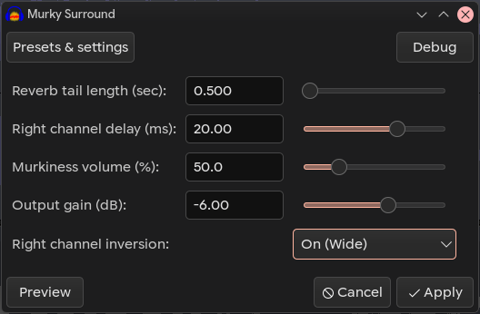

# Murky Surround (Audacity Nyquist Plugin)

  An experimental spatial audio tool designed for creating deep, immersive, and "murky" soundscapes. Unlike standard stereo wideners, this plugin focuses on low-frequency atmospheric textures and phase-shifting techniques to envelop the listener.
Overview

  Murky Surround was developed as a specialized tool for plunderphonics, lo-fi, and ambient music production. It excels at taking mono or narrow stereo sources and transforming them into a wide, cavernous space without losing the "dark" character of the original sound.

# The plugin uses a combination of:

* Dual-band EQ: Preserving the core while slightly lifting the presence.

* Isolated Wet Reverb: Extracting 100% of the reverb tail.

* Phase Inversion & Time Offset: Utilizing a 20ms+ delay and inverted phase to create a massive psychoacoustic stereo image.

* DSP "0.999" Trick: Ensuring digital stability and preventing clipping during phase summation.

# Installation

* [Download](https://github.com/LicaRedMoth/murky-surround/blob/main/murky-surround.ny) the murky-surround.ny file.

* Open Audacity.

* Go to Tools -> Nyquist Plugin Installer.

* Select the downloaded file and click Open.

* Restart Audacity or check Effect -> Murky Surround.

# Controls

* Reverb tail length (sec): Controls how long the "murk" lingers.

* Right channel delay (ms): Adjusts the spatial offset. 20ms is the sweet spot for the Haas effect.

* Murkiness volume (%): The intensity of the low-pass filtered reverb tail.

* Output gain (dB): Final volume adjustment.

* Right channel inversion: Toggles phase inversion for ultra-wide "out-of-head" experience.

# License

This project is licensed under the MIT License — see the [LICENSE](LICENCE) file for details.
Credits

---

Developed by [RedMoth](https://github.com/LicaRedMoth) in collaboration with [Gemini (Google AI)](https://gemini.google.com).
